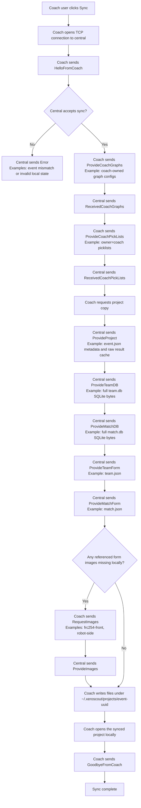

# Database Structure And Sync Deep Dive

This document describes how XeroScout currently stores event data, how sync is initiated, the exact packet flow used during sync, and what gets merged, overwritten, or left alone.

It is based on the current implementation in:

- `main/src/main/project/`
- `main/src/main/model/`
- `main/src/main/apps/scscout.ts`
- `main/src/main/apps/sccentral.ts`
- `main/src/main/apps/sccoach.ts`
- `main/src/main/sync/`

## Reading Guide

If you are trying to understand the system from the code outward, these are the most important files to read first:

- `main/src/main/project/project.ts`: project lifecycle, lock flow, and manager wiring
- `main/src/main/project/datamgr.ts`: the bridge between sync payloads and the SQLite models
- `main/src/main/model/datamodel.ts`: dynamic schema creation and insert-or-update behavior
- `main/src/main/apps/scscout.ts`: scout-side handshake, missing-data download, and upload
- `main/src/main/apps/sccentral.ts`: central-side packet handlers and authoritative sync responses
- `main/src/main/apps/sccoach.ts`: coach-side full-project sync behavior
- `main/src/main/sync/syncbase.ts`: packet framing, checksum, and packet extraction

## Component Map

This is the shortest useful mental map of the implementation.

### Storage and project state

- `Project`
  - owns the event directory and all managers
  - creates/opens the event
  - locks the event and initializes the databases
- `ProjectInfo`
  - JSON-serializable metadata persisted in `event.json`
- `DataManager`
  - routes result payloads into either the team or match database
  - maintains the raw sync-result caches kept in `event.json`
- `FormManager`
  - owns form file paths
  - validates forms
  - extracts form-defined DB columns
- `ImageManager`
  - owns the local image cache
  - syncs images as base64 payloads

### SQLite layer

- `DataModel`
  - shared base class for SQLite access, column creation, and upsert logic
- `TeamDataModel`
  - team table schema and team result ingestion
- `MatchDataModel`
  - match table schema and match result ingestion
- `DataRecord`
  - in-memory typed row container used during insert/update flows

### Sync transport and protocol

- `SyncBase`
  - packet framing, buffering, checksum, and packet extraction
- `TCPClient`
  - scout/coach TCP client transport
- `TCPSyncServer`
  - central TCP server transport
- `PacketObj`
  - packet type plus payload bytes
- `PacketType`
  - protocol enum

### App roles

- `SCCentral`
  - authoritative packet handler implementation
- `SCScout`
  - missing-data downloader and scouting-result uploader
- `SCCoach`
  - full-project replica downloader plus coach-config uploader

## 1. High-Level Architecture

There are three relevant app roles:

- `central`: the authoritative event host
- `scout`: the tablet used to collect team or match scouting data
- `coach`: a read-mostly consumer that syncs a local copy of the entire project databases, plus pushes its own coach-owned graph/picklist config back to central

The system persists data in two different forms:

- JSON files for project metadata, configuration, schedules, and cached scouting payloads
- SQLite databases for the team and match datasets used by central and coach

At a high level:

- `central` owns the canonical event definition and canonical SQLite databases
- `scout` does not maintain SQLite databases; it stores synced metadata and unsent/already-sent scouting results in a JSON file keyed by event UUID
- `coach` receives a full copy of `event.json`, `team.db`, and `match.db`, and then opens those locally as a normal project

## 2. Where Data Lives

### 2.1 Central event storage

A central event lives in an event directory chosen by the user. That directory contains at least:

- `event.json`
- `team.db`
- `match.db`
- copied form files such as `team.json` and `match.json`

`event.json` is the main project metadata file. It contains:

- event identity and lock state
- Blue Alliance or manual event setup information
- tablet definitions and generated assignments
- formulas, datasets, picklists, graphs, playoff state
- column metadata for both SQLite databases
- cached synced scouting result payloads in `data_info_`

`team.db` and `match.db` are created when the event is locked.

### 2.2 Scout local storage

The scout app stores its local state under the app directory:

- `~/.xeroscout/`

The active event state is stored as a JSON file whose filename is the event UUID. The app also stores a setting pointing to the last synced event UUID so it can reopen that state on launch.

The scout-side JSON contains:

- tablet identity
- tablet purpose (`team` or `match`)
- event UUID and event name
- synced forms
- synced team and match assignments
- local scouting results for assigned items
- cached team results used by match scouting screens
- synced playoff assignments and playoff status

The scout app also stores synced images under the user-data image cache managed by `ImageManager`.

Important: the scout app is not backed by `team.db` or `match.db`. Its local persistent state is JSON plus cached images.

### 2.3 Coach local storage

The coach app stores synced projects under:

- `~/.xeroscout/projects/<event-uuid>/`

During sync, central sends:

- `event.json`
- `team.db`
- `match.db`
- `team.json`
- `match.json`
- any missing form images

The coach app writes those files locally, then opens the synced project directory as a normal project.

## 3. Database Structure

### 3.1 SQLite databases

There are exactly two SQLite databases:

- `team.db`, containing table `teams`
- `match.db`, containing table `matches`

These are managed by:

- `TeamDataModel`
- `MatchDataModel`
- shared base class `DataModel`

### 3.2 Base table keys

The `teams` table starts with these base columns:

- `key` (`TEXT`)
- `team_number` (`INTEGER`)

The practical merge key used for team upserts is:

- `team_number`

The `matches` table starts with these base columns:

- `key` (`TEXT`)
- `comp_level` (`TEXT`)
- `set_number` (`REAL` in the SQL definition, but used as integer semantics)
- `match_number` (`REAL` in the SQL definition, but used as integer semantics)
- `team_key` (`TEXT`)

The practical merge key used for match upserts is:

- `comp_level`
- `set_number`
- `match_number`
- `team_key`

Each logical FRC match becomes six rows in `match.db`, one per team/alliance slot.

### 3.3 Dynamic columns

Most columns are not hardcoded. They are added dynamically with `ALTER TABLE ... ADD COLUMN ...` when data arrives.

Column definitions are tracked in `ProjectInfo` through:

- `team_db_info_.col_descs_`
- `match_db_info_.col_descs_`

Each `IPCColumnDesc` records:

- column name
- value type
- source
- whether the column is editable

Column `source` is one of:

- `base`
- `form`
- `bluealliance`
- `statbotics`

### 3.4 How form fields become DB columns

When the event is locked:

1. `DataManager.init()` opens or creates `team.db` and `match.db`
2. Blue Alliance team data is inserted into `team.db`
3. Blue Alliance match schedule is inserted into `match.db`
4. `FormManager.populateDBWithForms()` removes old form-sourced columns
5. The current team and match form data-bearing controls are converted into `IPCColumnDesc[]`
6. Those columns are created in the SQLite tables

This means the schema is partly form-defined. Changing forms and re-locking can change the schema.

Important detail:

- old `form` columns are removed before new form columns are added
- non-form columns from `base`, `bluealliance`, and `statbotics` remain

### 3.5 Typed values and SQLite storage

The app uses `IPCTypedDataValue` in memory, then converts those to SQLite-compatible primitives before writing:

- `string` -> text
- `integer` -> integer
- `real` -> real
- `boolean` -> integer/boolean-compatible SQLite value
- `null` -> null

Array and error values are not stored directly in SQLite.

### 3.6 Key database classes and methods

The storage behavior is concentrated in a small number of methods.

- `DataModel.addColsAndData()`
  - computes any missing columns from incoming records
  - creates those columns if necessary
  - writes each record via `insertOrUpdate()`
- `DataModel.insertOrUpdate()`
  - checks whether a row already exists for the natural key
  - updates the row if it exists
  - inserts a new row otherwise
- `DataModel.updateRecord()`
  - updates only the fields present in the incoming `DataRecord`
- `FormManager.populateDBWithForms()`
  - removes old form-sourced columns
  - recreates columns from the current team and match forms
- `DataManager.processResults()`
  - dispatches synced results to the correct model
  - merges the raw result cache stored in `event.json`

### 3.7 Focused snippet: row upsert behavior

This is the core write path in `DataModel`. It is the reason sync behaves as “upsert by natural key” rather than append-only.

```ts
public async insertOrUpdate(table: string, keys: string[], dr: DataRecord) : Promise<void> {
    let results = this.generateWhereClause(keys, dr) ;
    let query: string = 'select * from ' + table + results[0] + ';' ;
    let rows = await this.all(query, results[1]) ;
    if (rows.length > 0) {
        await this.updateRecord(table, keys, dr)
    }
    else {
        await this.insertRecord(table, dr) ;
    }
}
```

Implications:

- the key columns define row identity
- repeated syncs for the same logical item target the same row
- updates are partial at the column level because `updateRecord()` only writes fields present in the incoming record

## 4. What `event.json` Stores For Data

Central uses `DataInfo` inside `event.json` to store metadata around the databases and sync:

- team DB column config for UI
- match DB column config for UI
- `scouted_team_`: list of team numbers that have scouting data
- `scouted_match_`: list of scouted match item IDs
- `team_results_`: latest raw synced team scouting payloads by `item`
- `match_results_`: latest raw synced match scouting payloads by `item`
- team/match DB formatting formulas

This matters because central does not only persist processed row values in SQLite. It also keeps the latest raw scouting payloads in `event.json`, and those payloads are what get sent back to scouts when they request missing results.

## 5. Sync Transport And Packet Format

Sync is implemented over TCP. Central runs `TCPSyncServer`, while scout and coach use `TCPClient`.

The packet header format is:

- 4 bytes: packet type
- 4 bytes: payload length
- 2 bytes: compression type
- N bytes: payload
- 2 bytes: checksum

Current behavior:

- compression is always `PacketCompressionNone`
- checksum is a simple 16-bit additive checksum over the payload

Packet types are defined in `main/src/main/sync/packettypes.ts`.

### 5.1 Focused snippet: packet framing

The protocol is not HTTP or JSON-over-lines. It is a custom framed binary envelope carrying JSON or raw DB bytes.

```ts
buffer[0] = (p.type_ >> 0) & 0xff ;
buffer[4] = (p.data_.length >> 0) & 0xff ;
buffer[8] = (comp >> 0) & 0xff ;
buffer.set(p.data_, 10) ;

let csum = this.computeSum16(p.data_, 0, p.data_.length) ;
buffer[p.data_.length + 10] = (csum >> 0) & 0xff;
buffer[p.data_.length + 11] = (csum >> 8) & 0xff ;
```

That framing lives in `SyncBase.convertToBytes()` and is decoded in `SyncBase.extractPacket()`.

## 6. When Sync Server Starts

Central starts the sync server when a locked event is opened or created. It also starts UDP broadcast for discovery/advertising.

Central maintains two guard flags around sync:

- `tablets_syncing_`
- `external_download_in_progress_`

Behavior:

- external data downloads are blocked while tablets are syncing
- scout sync is rejected while central is in the middle of an external download

## 7. Scout Sync Initiation

Scout sync can be initiated from the menu using:

- local `127.0.0.1`
- cable `192.168.1.1`
- WiFi or manual address flow

Before any sync connection attempt:

- the scout app asks the renderer for current in-progress form results
- those results are written into the scout’s local JSON cache

That means sync always pushes the latest in-memory form state it can collect before connecting.

### 7.1 Key scout-side methods

If you are stepping through scout sync in a debugger, start here:

- `SCScout.syncClient()`
  - opens the connection, sends the initial hello, and installs packet handlers
- `SCScout.syncTablet()`
  - handles every incoming packet from central
- `SCScout.getMissingData()`
  - the finite-state “what do I still need?” driver
- `SCScout.sendScoutingData()`
  - sends the final `ProvideResults` payload after download is complete

### 7.2 Focused snippet: scout-side sync driver

`getMissingData()` is the clearest expression of the scouter sync state machine.

```ts
if (!this.team_form_received_) {
    this.conn_?.send(new PacketObj(PacketType.RequestTeamForm)) ;
}
else if (!this.match_form_received_) {
    this.conn_?.send(new PacketObj(PacketType.RequestMatchForm)) ;
}
else if (!this.match_list_received_) {
    this.conn_?.send(new PacketObj(PacketType.RequestMatchList)) ;
}
else if (!this.team_list_received_) {
    this.conn_?.send(new PacketObj(PacketType.RequestTeamList)) ;
}
else if (!this.match_results_received_ && this.needMatchResults().length > 0) {
    this.conn_?.send(new PacketObj(PacketType.RequestMatchResults, ...)) ;
}
```

This method is important because it encodes:

- the order of requests
- the fact that scout waits for each response before advancing
- the fact that sync completes only when there is nothing left to request

## 8. Full Scout Sync Sequence

This is the scouter-to-central sync flow.

### 8.1 Handshake

1. Scout connects to central over TCP.
2. Scout sends `HelloFromScouter`.
3. If the scout already has a tablet identity, the hello payload includes:
   - tablet name
   - purpose
4. Central replies with `HelloFromScouter` containing:
   - event UUID
   - event name

Guardrails:

- if central is busy with external downloads, it responds with `Error`
- if the scout already has an event UUID and the UUID does not match central’s UUID, scout aborts and tells the user to reset the tablet

### 8.2 New tablet initialization path

If the scout does not yet know its tablet identity:

1. Scout requests `RequestTablets`
2. Central replies `ProvideTablets` with all unassigned tablets
3. User chooses a tablet and purpose
4. Scout persists that assignment locally
5. Scout starts the normal missing-data fetch pipeline

Central marks this sync session type as `"initialize"` when serving the tablet list.

### 8.3 Missing-data fetch pipeline

Once handshake and tablet assignment are handled, scout fetches data in this fixed order:

1. `RequestTeamForm`
2. `RequestMatchForm`
3. `RequestMatchList`
4. `RequestTeamList`
5. `RequestMatchResults` if needed
6. `RequestTeamResults` if needed
7. `RequestImages` if needed
8. `RequestPlayoffAssignments` if not already known
9. `RequestPlayoffStatus`

The scout only moves to the next step once the previous response has been received and processed.

### 8.4 What each response does on scout

- `ProvideTeamForm`
  - stores the team form JSON locally
- `ProvideMatchForm`
  - stores the match form JSON locally
- `ProvideMatchList`
  - stores match-to-tablet assignments locally
- `ProvideTeamList`
  - stores team-to-tablet assignments locally
- `ProvideMatchResults`
  - fills in missing match result payloads
- `ProvideTeamResults`
  - fills in missing team result payloads and updates the local team-results cache
- `ProvideImages`
  - writes missing images into the scout image cache
- `ProvidePlayoffAssignments`
  - stores playoff tablet assignments if any
- `ProvidePlayoffStatus`
  - stores current playoff bracket/outcome state if any

### 8.5 Completion

When scout determines there is no more missing data:

1. it updates navigation/UI using the synced data
2. it sends `ProvideResults` containing all locally stored scouting results for that tablet
3. central processes those results
4. central replies `ReceivedResults`
5. scout sends `GoodbyeFromScouter`
6. central shows a sync-complete message and clears `tablets_syncing_`

### 8.6 Mermaid: scout sync end-to-end

This flowchart shows the actual scout sync order, including the points where different data types move.

```mermaid
flowchart TD
    START[Scout user clicks Sync]
    SAVE[Scout saves in-memory form state to local JSON results_]
    CONNECT[Scout opens TCP connection to central]
    HELLO[Scout sends HelloFromScouter]
    CHECK{Central accepts sync?}
    ERR[Central sends Error<br/>Examples: event mismatch, external download in progress]
    UUID{Scout already has tablet identity?}
    REQTABS[Scout sends RequestTablets]
    PROVTABS[Central sends ProvideTablets<br/>Example: tablet names and purposes]
    ASSIGN[User selects tablet and purpose]
    TEAMFORM[Scout sends RequestTeamForm]
    TEAMFORMRESP[Central sends ProvideTeamForm<br/>Example: team.json with image/autoplan/autoselector controls]
    MATCHFORM[Scout sends RequestMatchForm]
    MATCHFORMRESP[Central sends ProvideMatchForm<br/>Example: match.json with match scouting fields]
    MATCHLIST[Scout sends RequestMatchList]
    MATCHLISTRESP[Central sends ProvideMatchList<br/>Example: qm1 red1 frc254 assigned to tablet]
    TEAMLIST[Scout sends RequestTeamList]
    TEAMLISTRESP[Central sends ProvideTeamList<br/>Example: frc254, frc1678 team assignments]
    NEEDMATCH{Missing match results?}
    REQMATCHRES[Scout sends RequestMatchResults<br/>Example request ids: sm-qm-1-12-254]
    PROVMATCHRES[Central sends ProvideMatchResults<br/>Example payload: item sm-qm-1-12-254]
    NEEDTEAM{Missing team results?}
    REQTEAMRES[Scout sends RequestTeamResults<br/>Example request ids: st-254]
    PROVTEAMRES[Central sends ProvideTeamResults<br/>Example payload: item st-254]
    NEEDIMAGES{Missing form images?}
    REQIMAGES[Scout sends RequestImages<br/>Example names: frc254-front, robot-side, missing]
    PROVIMAGES[Central sends ProvideImages<br/>Example robot photo base64 plus mimeType and extension]
    REQPLAYASSIGN[Scout sends RequestPlayoffAssignments]
    PROVPLAYASSIGN[Central sends ProvidePlayoffAssignments<br/>Example: finals tablet reassignment]
    REQPLAYSTATUS[Scout sends RequestPlayoffStatus]
    PROVPLAYSTATUS[Central sends ProvidePlayoffStatus<br/>Example: bracket advancement state]
    READY[Scout has all required remote data]
    UPLOAD[Scout sends ProvideResults<br/>Examples: st-254 and sm-qm-1-12-254]
    INGEST[Central upserts SQLite rows and replaces raw cached items in event.json]
    ACK[Central sends ReceivedResults]
    BYE[Scout sends GoodbyeFromScouter]
    DONE[Sync complete]

    START --> SAVE --> CONNECT --> HELLO --> CHECK
    CHECK -->|No| ERR
    CHECK -->|Yes| UUID
    UUID -->|No| REQTABS --> PROVTABS --> ASSIGN --> TEAMFORM
    UUID -->|Yes| TEAMFORM
    TEAMFORM --> TEAMFORMRESP --> MATCHFORM --> MATCHFORMRESP --> MATCHLIST --> MATCHLISTRESP --> TEAMLIST --> TEAMLISTRESP --> NEEDMATCH
    NEEDMATCH -->|Yes| REQMATCHRES --> PROVMATCHRES --> NEEDTEAM
    NEEDMATCH -->|No| NEEDTEAM
    NEEDTEAM -->|Yes| REQTEAMRES --> PROVTEAMRES --> NEEDIMAGES
    NEEDTEAM -->|No| NEEDIMAGES
    NEEDIMAGES -->|Yes| REQIMAGES --> PROVIMAGES --> REQPLAYASSIGN
    NEEDIMAGES -->|No| REQPLAYASSIGN
    REQPLAYASSIGN --> PROVPLAYASSIGN --> REQPLAYSTATUS --> PROVPLAYSTATUS --> READY --> UPLOAD --> INGEST --> ACK --> BYE --> DONE
```



## 9. How Scout Decides What To Download

### 9.1 Match results

Scout computes the full list of match items assigned to its tablet and asks central only for the ones it does not already have in local `results_`.

Match item IDs look like:

- `sm-<comp_level>-<set_number>-<match_number>-<teamnumber>`

### 9.2 Team results

Behavior depends on tablet purpose.

For a team tablet:

- it asks only for team result items it does not already have cached locally

For a match tablet:

- it asks for all team scouting items from the team assignment list

That is intentional. Match scouting views can consume team scouting data as context, so match tablets pull the team results cache more broadly.

### 9.3 Images

Scout scans both synced forms for image-bearing controls:

- `image`
- `autoplan`
- `autoselector`

It extracts the referenced image names, compares them with the local image cache, and requests only missing ones.

## 10. What Central Sends Back During Scout Sync

Central serves scout sync from two places:

- the project metadata in `event.json`
- the canonical SQLite-backed project plus raw cached result payloads

Specifically:

- forms are sent from the stored form JSON files
- match/team assignments are sent from `TabletManager`
- playoff data is sent from `TabletManager` and `PlayoffManager`
- images are read from `ImageManager`
- match/team result payloads are read from `DataInfo.match_results_` and `DataInfo.team_results_`

Important: central does not reconstruct scout payloads from SQLite rows when serving `ProvideMatchResults` or `ProvideTeamResults`. It returns the raw cached `IPCScoutResult` objects stored in `event.json`.

### 10.1 Key central packet handlers

The central sync protocol is almost entirely implemented as packet handlers in `SCCentral`.

- `handleRequestHelloFromScouter()`
- `handleRequestTablets()`
- `handleRequestTeamForm()`
- `handleRequestMatchForm()`
- `handleRequestTeamList()`
- `handleRequestMatchList()`
- `handleRequestTeamResults()`
- `handleRequestMatchResults()`
- `handleRequestRequestImages()`
- `handleProvideResults()`

### 10.2 Focused snippet: central result ingestion

This is the single most important central-side sync call.

```ts
let obj : IPCScoutResults = JSON.parse(p.payloadAsString()) as IPCScoutResults ;
const count = await this.project!.data_mgr_!.processResults(obj) ;
return new PacketObj(PacketType.ReceivedResults);
```

Everything meaningful after scout upload happens below `DataManager.processResults()`.

## 11. How Up-Sync From Scout Works

Scout always sends:

- tablet name
- tablet purpose
- the full local `results_` array

It is not a delta protocol. There is no “send only changed items since last sync” logic.

### 11.1 Result object shape

Each result item is:

- `item`: the logical scouting target ID
- `data`: array of `{ tag, value }`

Examples:

- team: `st-254`
- match: `sm-qm-1-12-254`

### 11.2 Central processing path

When central receives `ProvideResults`:

1. it parses the JSON payload into `IPCScoutResults`
2. it calls `DataManager.processResults(obj)`
3. `DataManager` dispatches to:
   - `TeamDataModel.processScoutingResults()` for team data
   - `MatchDataModel.processScoutingResults()` for match data
4. those methods convert each result into a `DataRecord`
5. `DataModel.addColsAndData()` ensures any missing form columns exist
6. `DataModel.insertOrUpdate()` writes each row by natural key
7. `DataManager.mergeResults()` updates the cached raw result arrays in `event.json`
8. `DataManager` updates `scouted_team_` or `scouted_match_`
9. `event.json` is rewritten

### 11.3 Focused snippet: raw result cache merge

Central’s raw cache merge is not fieldwise. It is itemwise replacement.

```ts
private mergeResults(target: IPCScoutResult[], incoming: IPCScoutResult[]) {
    for (let res of incoming) {
        let index = target.findIndex((one) => one.item === res.item) ;
        if (index !== -1) {
            target[index] = res ;
        }
        else {
            target.push(res) ;
        }
    }
}
```

That means the canonical raw payload for a logical scouting item is always the latest full payload central saw for that `item`.

## 12. Actual Overwrite And Merge Semantics

This is the most important section.

### 12.1 Central SQLite row upsert behavior

Database writes use `insertOrUpdate()` keyed by the natural row identity:

- teams by `team_number`
- matches by `comp_level + set_number + match_number + team_key`

Behavior:

- if no row exists for the key, a new row is inserted
- if a row exists, central updates only the columns present in the incoming `DataRecord`

This means sync is row-based upsert, not append-only.

### 12.2 What gets overwritten on re-sync

If a scout re-syncs the same scouting item:

- the latest incoming values overwrite the existing row’s values for the fields included in the payload
- fields not included in the incoming payload are left as they were

In practice, scout normally stores and sends the full result object for an item, because `provideResults()` replaces the local cached result for that item before sync. So repeated sync of the same item usually behaves like “last full result wins.”

### 12.3 Raw result cache overwrite behavior on central

Central also stores raw result payloads in:

- `DataInfo.team_results_`
- `DataInfo.match_results_`

`DataManager.mergeResults()` uses `item` as the unique key:

- new `item` -> append
- existing `item` -> replace the stored payload with the incoming one

So the raw result cache is also “last result for this item wins.”

### 12.4 Tablet down-sync conflict behavior

When scout receives `ProvideMatchResults` or `ProvideTeamResults`, it only inserts a remote result if the local tablet does not already have that item in `results_`.

That means:

- central data backfills missing local items
- central does not overwrite an existing local scout result during down-sync

So for scout tablets, local existing data wins over remote during the download phase.

### 12.5 Team result cache behavior on scout

Scout keeps a separate `team_results_cache_`.

Behavior:

- when synced team results arrive, the cache entry is replaced if the `item` already exists
- match forms can read the active team result from that cache

This cache is not the canonical source on central; it is a local convenience cache on scout.

### 12.6 Coach sync overwrite behavior

Coach sync is much more blunt than scout sync.

Central sends entire files:

- `event.json`
- `team.db`
- `match.db`

Coach writes them directly to disk, overwriting the local copies for that event UUID.

So for coach:

- the central project metadata overwrites local event metadata
- the entire SQLite databases overwrite local SQLite databases

There is no row-level merge for those DB files on coach.

### 12.7 Coach-owned config up-sync behavior

Before coach requests the project and DB files, it sends:

- `ProvideCoachGraphs`
- `ProvideCoachPickLists`

Central stores only coach-owned data from those payloads:

- graph configs are written into `graph_mgr_.coachConfigs`
- picklists are filtered to `owner === 'coach'` before replacing `picklist_mgr_.coachesPicklists`

That means:

- coach-owned graph/picklist config is pushed up to central
- central-owned graph/picklist config is not overwritten by coach
- for coach-owned config, the incoming coach payload effectively replaces the previous stored coach-owned set

### 12.8 Focused snippet: partial row overwrite

The row update query is assembled only from the fields present in the incoming `DataRecord`.

```ts
for(let key of dr.keys()) {
    if (!keys.includes(key)) {
        query += key + '= ?' ;
        params.push(DataValue.toSQLite3Value(v!)) ;
    }
}
```

That detail matters because it means:

- sync does not automatically null out omitted columns
- a partial incoming payload can leave old values behind in columns it does not mention

That is why the practical behavior depends on whether the scout payload is effectively “full item state” or only a partial subset of fields.

## 13. Locking And Initial Database Population

The lock step is what turns an editable event setup into a syncable event with SQLite data.

When central locks an event, it requires:

- teams
- forms
- valid tablet assignments
- optional matches

The lock flow:

1. validate forms
2. initialize `team.db` and `match.db`
3. import Blue Alliance team data into `team.db`
4. import Blue Alliance match schedule into `match.db` if matches exist
5. generate tablet schedules
6. remove stale form columns
7. add current form columns
8. mark event locked
9. generate/store event UUID
10. write `event.json`

That event UUID becomes the identity used by scout and coach sync.

## 14. Manual And UI Database Edits

Central also supports database edits from the DB views through `IPCChange[]`.

Those updates also use `insertOrUpdate()` with a search object as the key selector. So manual DB view edits follow the same general update model:

- find by key fields
- update the named column
- insert the row if it does not exist

This is separate from scout sync, but it uses the same lower-level storage primitive.

## 15. Images In Sync

Images are not stored inside SQLite or `event.json`.

They are managed by `ImageManager` and synced separately.

Behavior:

- central reads image files and sends base64 payloads
- scout and coach write them into their local image cache
- payloads support both legacy string data and structured objects with `data`, `mimeType`, and `extension`

If an image requested by scout is missing on central, central falls back to the `missing` image asset.

### 15.1 Key image-sync methods

- `SCScout.needImages()`
  - computes missing images from synced forms
- `SCCentral.handleRequestRequestImages()`
  - packages requested images as base64 payloads
- `SCCoach.computeMissingImages()`
  - coach-side equivalent for form images
- `ImageManager.addSyncedImage()`
  - validates and persists synced image payloads

### 15.2 Focused snippet: central image response shape

```ts
retdata[img] = {
    data: fs.readFileSync(info.path).toString('base64'),
    mimeType: info.mimeType,
    extension: info.extension,
} ;
```

The image layer is deliberately file-based and separate from both SQLite and `event.json`.

### 15.3 Mermaid: image and robot-photo sync path

This is the focused image path used by both scout and coach when forms reference image assets.

```mermaid
flowchart TD
    FORM[Local synced forms exist]
    SCAN[Client scans controls for image references]
    TYPES[Relevant control types<br/>image, autoplan, autoselector]
    NAMES[Extract image names<br/>Examples: frc254-front, frc254-side, missing]
    CACHE{Already in local image cache?}
    REQUEST[Send RequestImages with only missing names]
    LOOKUP[Central ImageManager resolves each requested name]
    FOUND{Image file exists?}
    READ[Central reads file bytes and encodes base64]
    FALLBACK[Central substitutes built-in missing image]
    PACK[Central sends ProvideImages<br/>Example entry: {data, mimeType, extension}]
    WRITE[Client ImageManager.addSyncedImage writes image file]
    READY[Forms can render robot photos locally]

    FORM --> SCAN --> TYPES --> NAMES --> CACHE
    CACHE -->|No missing images| READY
    CACHE -->|Missing images exist| REQUEST --> LOOKUP --> FOUND
    FOUND -->|Yes| READ --> PACK
    FOUND -->|No| FALLBACK --> PACK
    PACK --> WRITE --> READY
```

Example robot photo payload shape:

```ts
{
  "frc254-front": {
    "data": "<base64 image bytes>",
    "mimeType": "image/jpeg",
    "extension": ".jpg"
  }
}
```

## 16. Failure Handling And Guardrails

### 16.1 Event mismatch

Both scout and coach reject sync if the currently loaded local event UUID does not match the central event UUID.

The user is told to reset the device to sync to the new event.

### 16.2 Invalid stored forms on central

When central receives `RequestTeamForm` or `RequestMatchForm`, it re-validates the stored form file before sending it.

If validation fails:

- central responds with `Error`
- sync does not continue normally

### 16.3 External-download conflict protection

Central will not let scouts sync while it is downloading data from Blue Alliance or Statbotics. Likewise, central blocks those external downloads while tablets are syncing.

This avoids two writers trying to mutate the project at the same time.

## 17. Practical Summary Of “Who Wins”

### 17.1 Scout downloading from central

- missing local data is filled from central
- existing local scout result entries are not overwritten by central during the download stage

Winner: local scout result, if it already exists on the tablet

### 17.2 Scout uploading to central

- incoming scout result for an existing `item` replaces the cached raw result payload on central
- incoming scout result updates the matching SQLite row by natural key

Winner: latest synced scout payload for that `item`

### 17.3 Coach syncing project copy

- central’s `event.json`, `team.db`, and `match.db` replace the coach-local copies

Winner: central

### 17.4 Coach pushing coach-owned configs

- coach-owned graph configs and coach-owned picklists are pushed to central and replace the previous coach-owned stored sets
- central-owned configs remain central-owned

Winner: coach, but only for coach-owned config domains

## 18. Mermaid: coach sync end-to-end

Coach sync is a different protocol shape from scout sync. It uploads coach-owned config first, then receives a full project replica.



## 19. Mermaid: packet-to-data map

This is the quickest way to map each sync packet to the kind of data it moves.

```mermaid
flowchart TD
    HELLO[Hello packets]
    FORMS[Form packets]
    ASSIGN[Assignment packets]
    RESULTDOWN[Result download packets]
    RESULTUP[Result upload packets]
    IMAGES[Image packets]
    PLAYOFF[Playoff packets]
    COACHCFG[Coach config packets]
    DBFILES[Coach replica packets]

    HELLO --> HELLOEX[Examples<br/>HelloFromScouter, HelloFromCoach<br/>Data: event uuid, event name, tablet identity]
    FORMS --> FORMEX[Examples<br/>ProvideTeamForm, ProvideMatchForm<br/>Data: team.json, match.json]
    ASSIGN --> ASSIGNEX[Examples<br/>ProvideTablets, ProvideTeamList, ProvideMatchList<br/>Data: tablet names, team assignments, match assignments]
    RESULTDOWN --> RESULTDOWNEX[Examples<br/>ProvideTeamResults with st-254<br/>ProvideMatchResults with sm-qm-1-12-254]
    RESULTUP --> RESULTUPEX[Examples<br/>ProvideResults carrying full local results_ array]
    IMAGES --> IMAGEEX[Examples<br/>RequestImages for frc254-front<br/>ProvideImages with base64 robot photo payload]
    PLAYOFF --> PLAYOFFEX[Examples<br/>ProvidePlayoffAssignments, ProvidePlayoffStatus]
    COACHCFG --> COACHCFGEX[Examples<br/>ProvideCoachGraphs, ProvideCoachPickLists]
    DBFILES --> DBFILESEX[Examples<br/>ProvideProject event.json<br/>ProvideTeamDB team.db<br/>ProvideMatchDB match.db]
```



## 20. Important Implementation Consequences

These are the practical implications of the current design.

### 20.1 Scout sync is not delta-based

Scout always uploads its full local `results_` list. If that list grows, the sync payload grows too.

### 20.2 The canonical raw scouting payload lives in `event.json`

SQLite stores processed row values, but central still depends on `event.json` to rehydrate raw result payloads for scouts.

### 20.3 There is no explicit conflict-resolution timestamp

There is no per-field timestamp, revision number, or CRDT-style merge. Conflict behavior is mostly:

- tablet local data is preserved during down-sync
- latest uploaded result replaces prior central result for the same `item`

### 20.4 Match/team row identity is stable and natural-key based

Because upserts are based on natural keys, repeated syncs modify the same logical row rather than creating duplicates.

### 20.5 Schema is stateful and metadata-backed

The SQLite file is not the only schema source. `ProjectInfo.team_db_info_` and `ProjectInfo.match_db_info_` persist the column descriptors in `event.json`.

That has two consequences:

- the app can describe columns without introspecting SQLite every time
- schema drift is reconciled by `DataModel.syncColumnNames()`, which removes metadata entries for columns no longer present in the file

### 20.6 Central keeps two parallel representations of scouting data

The system maintains both:

- processed relational rows in SQLite
- raw result payloads in `event.json`

That duplication is intentional in the current design because scouts need the raw result payload form, not just the flattened row values.

## 21. Code Walkthrough By Responsibility

This section is the quickest way to orient a new engineer in the codebase.

### “Where is a scout result turned into a DB row?”

- team: `TeamDataModel.processScoutingResults()`
- match: `MatchDataModel.processScoutingResults()`

Those methods convert `IPCScoutResults` entries into `DataRecord`s and call `addColsAndData()`.

### “Where are new DB columns created?”

- `FormManager.populateDBWithForms()`
- `DataManager.createFormColumns()`
- `DataModel.createColumns()`

### “Where does central decide what to send?”

- `SCCentral.initPacketHandlers()`
- `SCCentral.processPacket()`

Those are the central protocol dispatcher and routing table.

### “Where does scout decide what it still needs?”

- `SCScout.needMatchResults()`
- `SCScout.needTeamResults()`
- `SCScout.needImages()`
- `SCScout.getMissingData()`

### “Where does coach do a full-file replica sync?”

- `SCCoach.syncTablet()`
- `SCCoach.receiveProject()`
- `SCCoach.receiveTeamDB()`
- `SCCoach.receiveMatchDB()`
- `SCCoach.finishSync()`

## 22. Suggested Debugging Path

If sync behavior is wrong and you need to diagnose it quickly, this is the highest-yield order to inspect:

1. Check the structured log file for `SyncPacket`, `ScoutMissingDataRequest`, `CentralResultsReceived`, and `CentralResultsProcessed`.
2. Confirm the event UUID on both devices matches.
3. Confirm central is locked and the sync server is running.
4. Inspect `event.json` on central to see whether the raw result cache was updated.
5. Inspect `team.db` or `match.db` to see whether the relational row changed.
6. If scout download behavior is wrong, inspect `needMatchResults()`, `needTeamResults()`, and `getMissingData()`.
7. If coach sync is wrong, inspect whether `ProvideProject`, `ProvideTeamDB`, and `ProvideMatchDB` were all received and written.

## 23. End-To-End Example

Example: a match scout edits `sm-qm-1-12-254` on a tablet and syncs.

1. tablet saves the edited result into local `results_`
2. tablet connects to central
3. central confirms event UUID
4. tablet fetches any missing forms, assignments, results, images, and playoff data
5. tablet sends all local results in `ProvideResults`
6. central converts `sm-qm-1-12-254` into a row keyed by:
   - `comp_level = qm`
   - `set_number = 1`
   - `match_number = 12`
   - `team_key = frc254`
7. if that row exists, the incoming fields overwrite the columns present in the payload
8. central replaces the cached raw `IPCScoutResult` for `sm-qm-1-12-254` in `match_results_`
9. central persists the updated row in `match.db`
10. central persists the updated raw cache in `event.json`

## 24. Bottom Line

The current sync model is:

- central is authoritative for event definition, schedules, forms, images, playoff state, and canonical SQLite data
- scout stores a local JSON cache plus images, fetches missing data from central, and then uploads its full local result set
- repeated scout syncs are upserts keyed by logical scouting target
- central keeps both processed SQLite rows and raw last-seen scouting payloads
- coach receives a full file-level copy of the project databases and metadata, while pushing only coach-owned configs back to central

If you want to reason about overwrites in one sentence:

- scout download is mostly fill-missing-only
- scout upload is last-result-wins per `item`
- coach DB sync is whole-file overwrite from central
